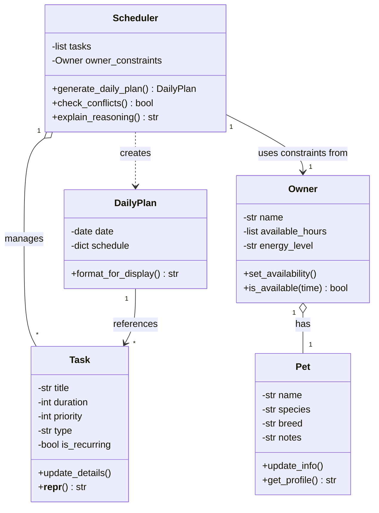

# PawPal+ Class Diagram

## Class Relationships

- **Owner ◇→ Pet**: Owner has a Pet (composition - one-to-one)
- **Scheduler ◇→ Task**: Scheduler manages multiple Task objects (aggregation - one-to-many)
- **Scheduler → Owner**: Scheduler uses one Owner's constraints (association - one-to-one)
- **Scheduler ⋯> DailyPlan**: Scheduler creates and returns DailyPlan (dependency - not stored)
- **DailyPlan → Task**: DailyPlan references scheduled Tasks in its schedule dict (association - one-to-many)

## Notes

- Priority levels: 1=High, 2=Medium, 3=Low
- available_hours format: List of tuples like [("08:00", "09:00"), ("17:00", "22:00")]
- schedule format: Dictionary mapping time slots to Task objects
- Task types: "Health", "Fun", "Feeding", etc.
